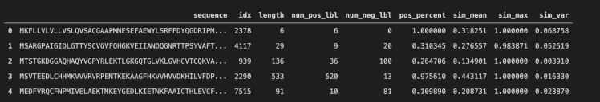
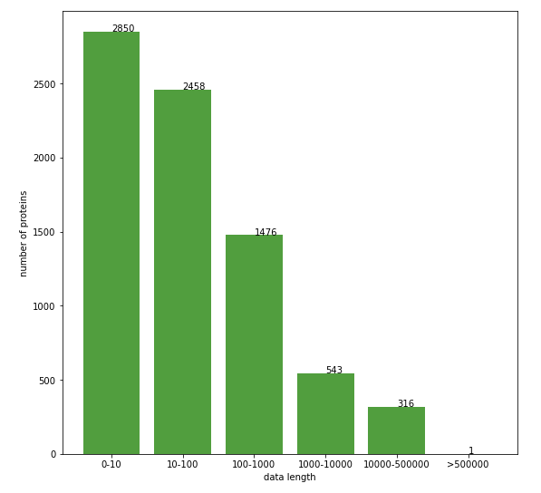
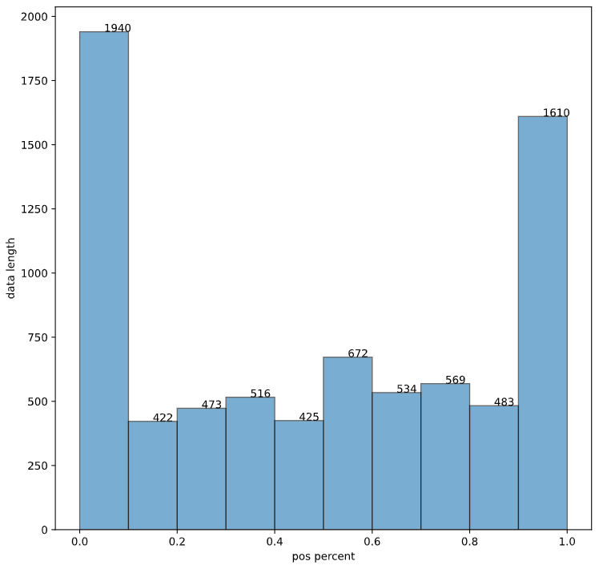
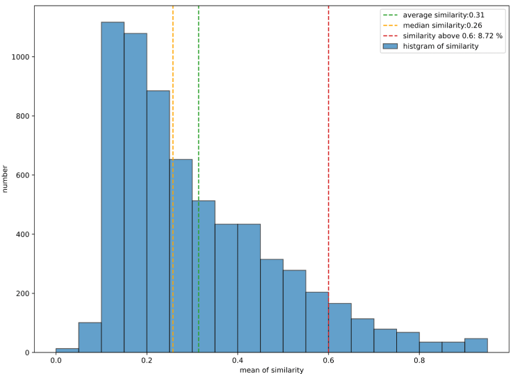
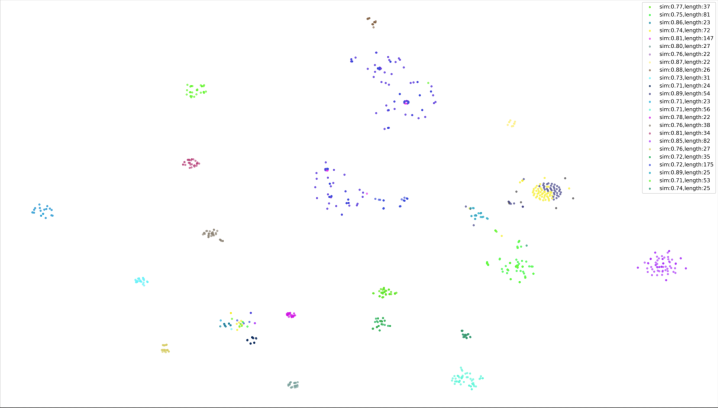
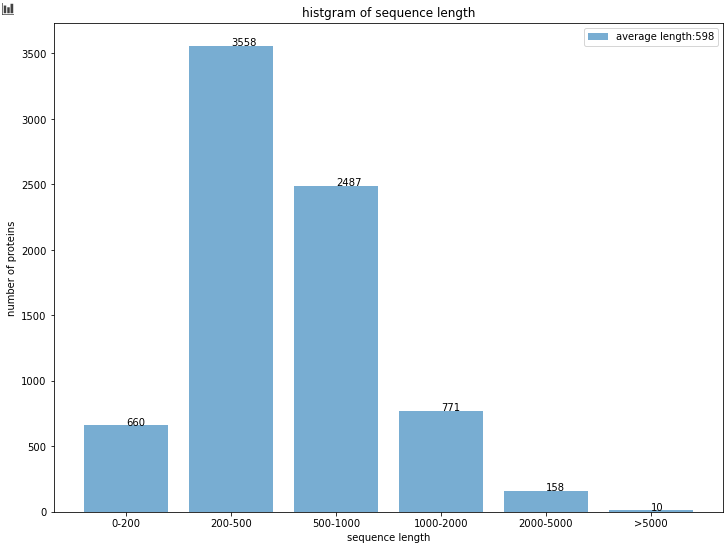
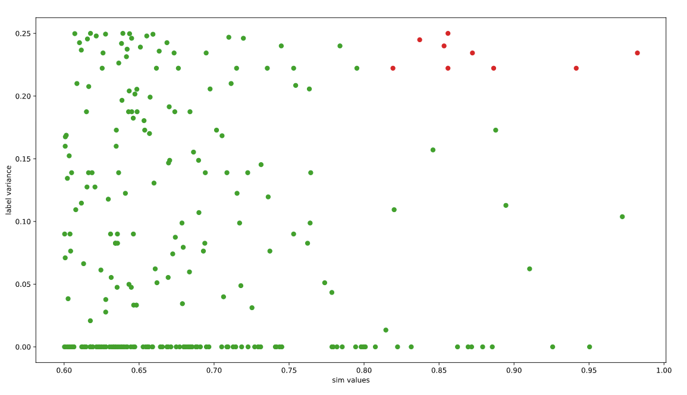
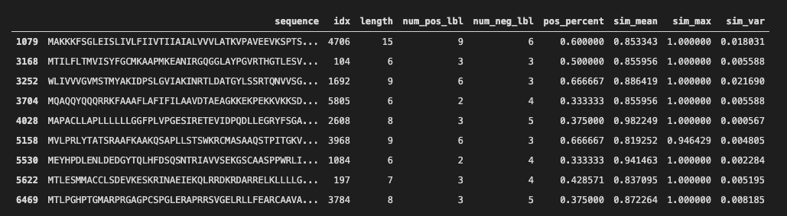

# Data Analysis

My work in Galixir


看结果直接跳到第五部分，前面都是处理方法！
## 1. 数据组成

```
.
├── ALL
│   ├── Glx4.1.0_ALL_IC50.csv
│   ├── Glx4.1.0_ALL_IC50.csv.tar.gz
│   ├── Glx4.1.0_ALL_Kd.csv
│   ├── Glx4.1.0_ALL_Kd.csv.tar.gz
│   ├── Glx4.1.0_ALL_Ki.csv
│   ├── Glx4.1.0_ALL_Ki.csv.tar.gz
│   ├── Glx4.1.0_EXTEND_ALL_IC50.csv
│   ├── Glx4.1.0_EXTEND_ALL_IC50.csv.tar.gz
│   ├── Glx4.1.0_EXTEND_ALL_Ki.csv
│   └── Glx4.1.0_EXTEND_ALL_Ki.csv.tar.gz
├── CLF
│   ├── Glx4.1.0_clf_Pubchem_Gene_Classification_Data_91128837.zip
│   └── Glx4.1.0_clf_Pubchem_Uniprot_Classification_Data_79980610.zip
└── HUMAN
    ├── Glx4.1.0_EXTEND_HUMAN_IC50.csv.tar.gz
    ├── Glx4.1.0_EXTEND_HUMAN_Ki.csv.tar.gz
    ├── Glx4.1.0_HUMAN_IC50.csv.tar.gz
    ├── Glx4.1.0_HUMAN_Kd.csv.tar.gz
    └── Glx4.1.0_HUMAN_Ki.csv.tar.gz
```
## 2. 数据大小
   

| 名称 | 大小 | 行数(数据量) |
| ---- | ---- | ---- |
|  Glx4.1.0_ALL_IC50 | 1.3G | 1540523 |
|Glx4.1.0_ALL_Ki|453M|711110|
|Glx4.1.0_ALL_Kd|30M|39941|
|Glx4.1.0_EXTEND_ALL_IC50|1.7G|2197458|
|Glx4.1.0_EXTEND_ALL_Ki|1.7G|2197458|
|Glx4.1.0_clf_Pubchem_Gene_Classification_Data_91128837|61G|91128838|
|Glx_Pubchem_Uniprot_Classification_Data_79980610|53G|79980611|


主要处理Glx_Pubchem_Uniprot_Classification_Data_79980610里面的数据，下面简称8000万数据

## 3. 任务目标

对于每个蛋白质sequence：

统计其对应的数据条数，分子是否有重复？✅
统计其标签分布，是否为全0？全1？标签分布是否均匀？✅
统计其分子的相似度，采用相似度度量方法，✅降维，聚类，可视化✅，是否这个sequence对应的分子都相关？

对于所有蛋白质：

统计蛋每个蛋白质对应的分子数，分布是否均匀？是否有的蛋白质数据过多？✅


## 4. 处理方法调研
下面两种处理大量数据的方法：

#### 4.1 Dask
https://www.pybloggers.com/2016/11/dask-a-better-way-to-work-with-large-csv-files-in-python/
安装：
```
pip install dask toolz cloudpickle
```


用法：
```
import dask.dataframe as dd
 
filename = 'xxx.csv'
df = dd.read_csv(filename, dtype='str')
```


## 4.2 CUDF
https://github.com/rapidsai/cudf

https://docs.rapids.ai/api/cudf/stable/10min.html

安装：
```
conda install -c rapidsai-nightly -c nvidia -c numba -c conda-forge cudf python=3.7 cudatoolkit=11.0
```

不幸的是，读取数据时，都内存/显存不够。所以需要将大数据切成小分处理。

```
在10.10.10.6:/gxr/tongyuang/data/CPI/GLX4.1.0/sub_data/Glx4.1.0_clf_Pubchem_Uniprot_Classification_Data_79980610下

运行：

bash split_file_to_part_based_on_line.sh /gxr/yize/data/CPI/GLX4.1.0/CLF/Glx_Pubchem_Uniprot_Classification_Data_79980610.csv 1000000 part

表示把数据切成一百万一行的csv，一共80个，保存在10.10.10.6:/gxr/tongyuang/data/CPI/GLX4.1.0/sub_data/Glx4.1.0_clf_Pubchem_Uniprot_Classification_Data_79980610下

运行结果：

FILE_EXT: csv
FILE_LINES: 79980611
FILE_NUMBER: 79
LAST_FILE_LINE: 980611
```

切分后，遍历每个小数据集，对每个蛋白质输出一个.npy文件，例如：
```
在10.10.10.6:/gxr/tongyuang/data/CPI/GLX4.1.0/sub_data/Glx4.1.0_clf_Pubchem_Uniprot_Classification_Data_79980610下

运行：

bash split_file_to_part_based_on_line.sh /gxr/yize/data/CPI/GLX4.1.0/CLF/Glx_Pubchem_Uniprot_Classification_Data_79980610.csv 1000000 part

表示把数据切成一百万一行的csv，一共80个，保存在10.10.10.6:/gxr/tongyuang/data/CPI/GLX4.1.0/sub_data/Glx4.1.0_clf_Pubchem_Uniprot_Classification_Data_79980610下

运行结果：

FILE_EXT: csv
FILE_LINES: 79980611
FILE_NUMBER: 79
LAST_FILE_LINE: 980611
```

## 5. 实验结果

统计了每个蛋白质的[sequence, idx, length, num_pos_lbl, num_neg_lbl, pos_percent, sim_mean, sim_max, sim_var]，数据保存在

10.10.10.6:/gxr/tongyuang/data/CPI/GLX4.1.0/data_analysis/sequence_statistics.csv


下图是表的前几行:



参数的含义：

|参数名	|含义|
| --- | ---- |
|sequence | 蛋白质的sequence|
|idx | 蛋白质的index，对应part4的定义
|length	|对应的分子数据量
num_pos_lbl|	正标签个数
num_neg_lbl	|负标签个数
pos_percent	|正标签比例
sim_mean	|对应所有分子的相似度均值
sim_max|	对应所有分子的相似度最大值
sim_var	|对应所有分子的相似度方差

分子相似度计算采用RDKIT的Tanimoto距离相似度矩阵，分别计算所有分子两两的相似度，然后计算均值、方差、最大值等。

其中，对于分子量过大的蛋白，我随机取了其中的1000条数据计算相似度，这里实在没想到更好的方法。
特殊情况如下表所示：

|mean=1 max=1, var=0	|蛋白只有一个分子数据|
| ---- | ---- |
|mean=0 max=0, var=0|rdkit工具计算出来相似度为0
|mean=-1, max=-1, var=-1|无法计算（很少）|

### 5.1  蛋白对应分子数量分析


上图统计蛋白数据条数与蛋白数量的关系。上图横轴是蛋白数据量（原图中一个蛋白对应了多少条数据），纵轴是蛋白数量。可见，数据量在0-10的蛋白有2850条，10-100的蛋白有2458条，100-1000的蛋白有1476条，1000-10000的蛋白有543条，10000-500000的蛋白有316条，50w以上的有1条。

### 5.2 蛋白标签分布

数据整体：

正标签：2061704 负标签：77918906 正标签占比：0.02578




上图统计了蛋白质的数据条数（取对数后）和所有标签中正标签占比（范围是0-1，0表示没有正标签，1表示全为正标签）。

横轴是取过对数的数据条数，纵轴是正标签占比。图中红色部分全是正标签，橙色部分正标签比例超过了75%，绿色部分正标签比例在25%-75%区间内，蓝色部分正标签比例小于25%，紫色部分正标签比例为0。

发现图中产生了看起来比较对称的结果，具体原因还在研究。
图中绿色部分比较适合进行训练或测试。

### 5.3 相似度分析


上图是分子的相似度均值分析。

原本有7644个蛋白，筛选后（对应分子数大于1）还有6602个蛋白可以进行相似度分析。上图是分子相似度均值直方图。可以看出大部分蛋白质的相似度均值在0.4以下，平均相似度均值是0.31，中位数是0.26。

筛选一下相似度比较大的蛋白，这里选择相似度均值大于0.7，并且对应的分子量大于20的蛋白，将其对应所有的分子进行聚类分析，结果如下：


聚类结果确实可以说明有的蛋白分子的相似度很高。图片地址10.10.10.6:/gxr/tongyuang/data/CPI/GLX4.1.0/data_analysis/results/cluster.png


### 5.4 蛋白长度分析

有的蛋白质的sequence特别长，有的特别短。分析蛋白质长度的结果如下图所示：

大部分蛋白质长度小于1000，有的蛋白特别长（高于5000）。

高于5000的蛋白保存了uniport_id，在/gxr/tongyuang/data/CPI/GLX4.1.0/data_analysis/long_sequence.csv

好在对应的数据量都不多，问题不大

## 6. 筛选分析

|全集|样本数>=100且活性分子数>=10	|样本数>=75且活性分子数>=7	|Label unique比例>=0.7|活性比例<0.3|
| ---- | ---- | ---- | ---- | ---- |
蛋白种类 | 7644|2266|2503|2669|2814|
样本数|79980610|79330842|79891350|940790|77857709

### 6.1 相似度和标签方差的关系




考虑到可能有的蛋白，其分子十分相似，但是标签不同（可能是标错了），作出横轴相似度均值——纵轴标签方差的图，图中红色点表示相似度较高，同时标签方差也比较大。图中筛选条件是相似度均值>0.6且对应数据量>5。

红点对应的数据：



### 6.2 随机筛选

考虑到数据集里负样本太多了，对每个蛋白，都按照如下规则筛选：

如果正样本占比大于等于0.18，保留
如果正样本占比小于0.18，则随机抛弃负样本，直到正样本占比在0.18

保存的数据在10.10.10.6:/gxr/tongyuang/data/CPI/GLX4.1.0/filtered_data/Glx_Pubchem_Uniprot_Classification_Data_DROP_1_7.csv

数据量：6153674，正样本：2017260，负样本：4136414  正样本占比0.33


